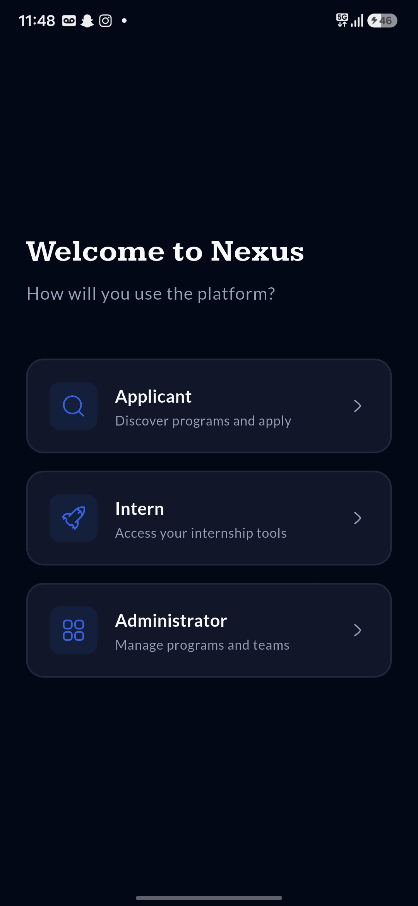
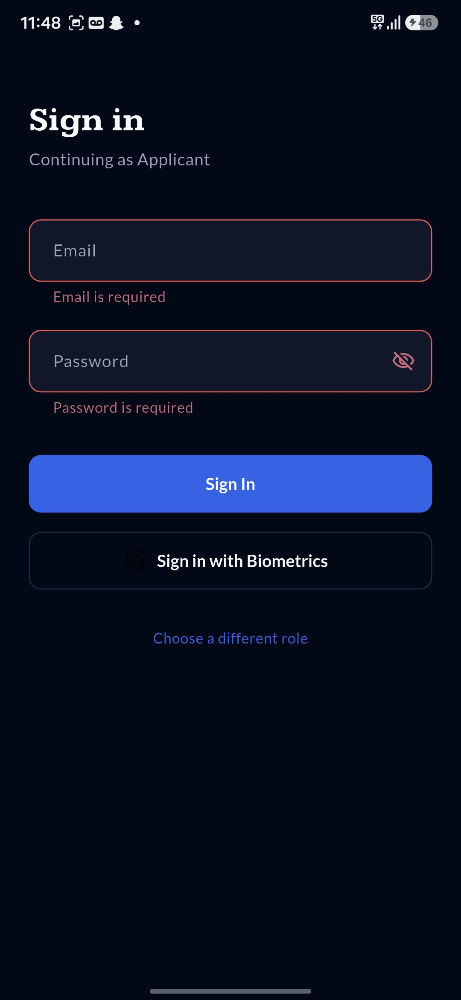
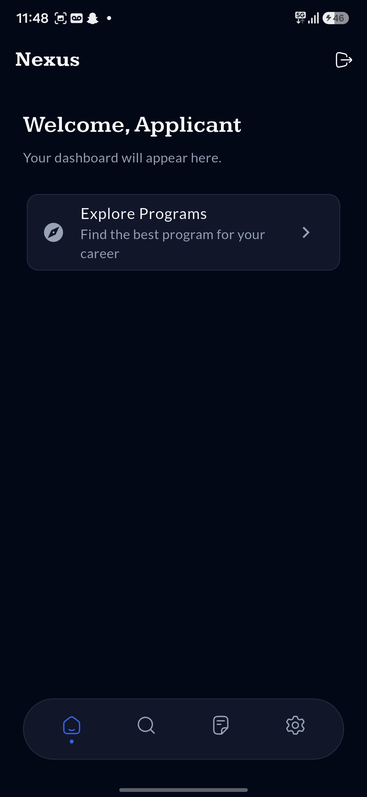
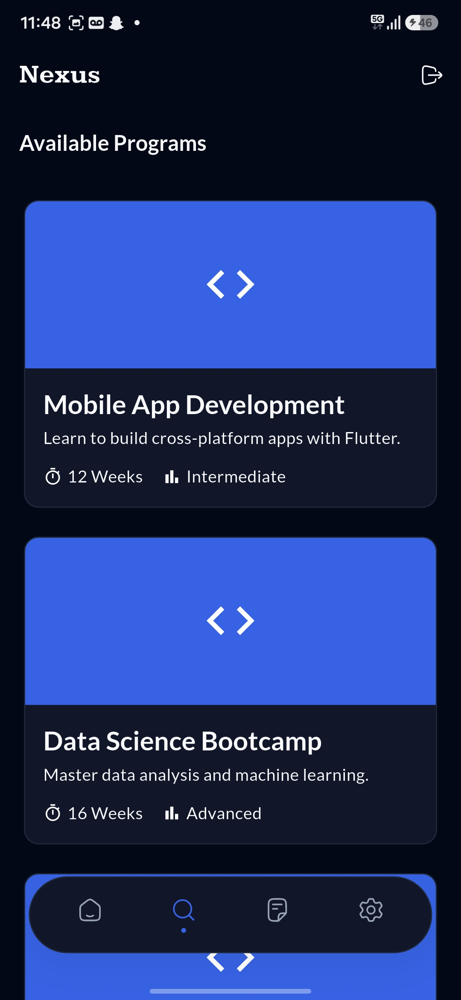
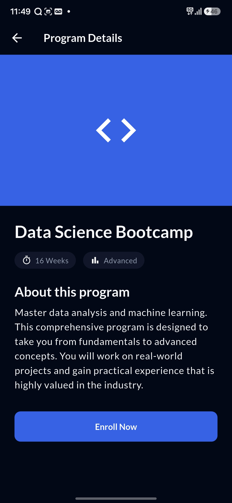

# Nexus - Excelerate Unified Platform 🚀

**Nexus** is an enterprise-grade, role-based platform designed to bridge the gap between aspiring talent and industry opportunities. Built with a focus on performance, security, and aesthetic minimalism, Nexus streamlines program discovery, internship tracking, and administrative oversight.

---

## 📱 App Preview (UI Prototype)

**Role Selection**


**Login Screen**


**Personal Dashboard**


**Program Discovery**


**Program Details**


---

## ✨ Key Features

### 🔐 Multi-Role Authentication
- **Tailored Onboarding**: Choose between Applicant, Intern, or Administrator roles.
- **Biometric Security**: Integrated Fingerprint/Face ID authentication for quick and secure access.
- **Input Validation**: Robust form validation to ensure data integrity during sign-in.

### 🔍 Dynamic Program Exploration
- **Curated Listings**: Browse through professional programs with real-time metadata (Duration, Difficulty Level).
- **Interactive Details**: Comprehensive program overviews with one-tap enrollment capabilities.

### 🎨 Design System
- **Typography**: A balanced mix of **Kameron** (Serif) for authoritative headings and **Lato** (Sans-serif) for high-readability body text.
- **Dark Mode Support**: A premium, low-light interface designed for enterprise efficiency and reduced eye strain.
- **HugeIcons Library**: Premium, high-stroke icons for a modern look and feel.

---

## 🛠️ Technical Stack

- **Framework**: [Flutter](https://flutter.dev) (v3.x)
- **Architecture**: Feature-Driven Layered Architecture (Clean Code Principles)
- **Routing**: [GoRouter](https://pub.dev/packages/go_router) for declarative, deep-link ready navigation.
- **State Management**: Controller-based pattern using `ChangeNotifier`.
- **Security**: [Local Auth](https://pub.dev/packages/local_auth) for hardware-level biometrics.

---

## 🏗️ Project Architecture

```text
lib/
├── app/          # Global config: Router, Themes, App Shell
├── core/         # Shared: Enums, Constants, Global Styles
├── features/     # Encapsulated Modules
│   ├── auth/     # Role selection, Login, Controller
│   ├── dashboard/# Home shell, Role-specific widgets
│   └── programs/ # Listing, Details, Domain Logic
└── shared/       # Common Widgets: Buttons, Cards, Inputs
```

---

## ⚙️ Getting Started

### Installation
1.  **Clone the Repository**
    ```bash
    git clone https://github.com/your-username/project_Nexus.git
    ```
2.  **Initialize Project**
    ```bash
    flutter pub get
    ```
3.  **Launch Application**
    ```bash
    flutter run
    ```

---

## ✅ Week 2 Milestones

- [x] **Role Selection Logic**: Implemented animated card-based selection.
- [x] **Secure Sign-In**: Built interactive login with biometric fallback.
- [x] **Unified Navigation**: Set up complex routing with `GoRouter` redirects.
- [x] **Discovery Modules**: Developed high-fidelity Program Listing and Detail views.

---
*Developed for the Excelerate Nexus Platform.
